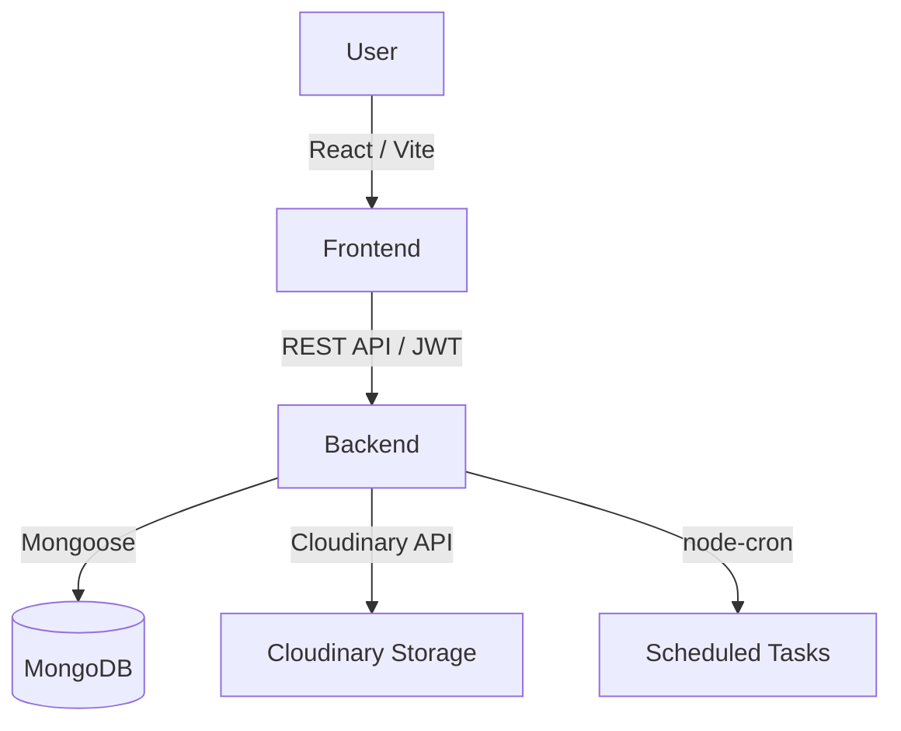

# The Legacy Trunk

> A digital family archive preserving stories, heirlooms, and memories across generations.

---

## 📌 Overview

**The Legacy Trunk** is a secure, private platform designed to help families build a digital archive. It solves the problem of fading family history by allowing members to record stories, build generational family trees, preserve media, and pass down digital heirlooms securely.

Whether you're mapping out your ancestry, sharing a memory from a recent holiday, or scheduling a "Time Capsule" for a future milestone, The Legacy Trunk ensures that your family's shared soul and magic live on.

---

## ✨ Features

### User Management & Authentication
* **Role-Based Access**: Granular roles (Creator, Admin, Member) within family groups.
* **Authentication**: Secure JWT-based authentication with bcrypt password hashing.

### Memories & Stories
* **Rich Story Creation**: Record and share text stories, photos, and videos.
* **AI-Powered Tagging & Search**: Automatically generates descriptive tags for uploaded photos using Google's Gemini AI, allowing users to effortlessly search their archives by context, objects, and activities.
* **Tagging**: Tag specific family members in memories.
* **Visibility Controls**: Keep memories private, share with selected members, or open them to the entire family circle.

### Secure Vault
* **Secondary Protection**: A dedicated, password-protected vault separate from general memories.
* **Cloud Storage**: Highly secure file and heirloom storage backed by Cloudinary.

### Family Tree Management
* **Generational Mapping**: Build a complete family tree by specifying relationships (parent, spouse, child, etc.).
* **Smart Auto-generation**: The system automatically calculates generations based on the tree structure.
* **Claim Codes**: Invite family members to claim their specific node in the family tree.

---

## 🏗️ System Architecture



### Application Flow
1. **User Authentication**: User logs in and receives an HTTP-only/secure JWT.
2. **Family Selection**: User selects or joins a family group (via Family Code).
3. **Data Retrieval**: Frontend fetches the family tree and memory feeds from the Express API.
4. **Media Upload**: Media is sent to the backend, which securely uploads it to Cloudinary and returns the URL.
5. **Scheduled Tasks**: A Node.js cron job runs in the background to check and deliver Time Capsules.

---

## 📂 Project Structure

```text
The-Legacy-Trunk/
├── frontend/             # React (Vite) application
│   ├── src/
│   │   ├── assets/       # Static files and images
│   │   ├── components/   # Reusable UI components (Modals, Feed, Vault)
│   │   ├── contexts/     # React state management
│   │   ├── hooks/        # Custom React hooks
│   │   ├── pages/        # Main application views (Home, Profile, Tree)
│   │   └── services/     # API integration logic
│   └── package.json
├── backend/              # Node.js / Express server
│   ├── config/           # Database config
│   ├── controllers/      # Route business logic
│   ├── middlewares/      # Error handling & auth middleware
│   ├── models/           # Mongoose schemas (User, Family, Person, Memory)
│   ├── routes/           # Express API endpoints
│   ├── utiles/           # Helpers and Cron job definitions
│   ├── server.js         # Entry point
│   └── package.json
└── README.md
```

---

## 🛠️ Tech Stack

| Technology | Purpose |
| ---------- | ------- |
| **React + Vite** | Fast, modern frontend framework |
| **Tailwind CSS** | Utility-first styling and responsive UI |
| **Node.js** | Backend JavaScript runtime |
| **Express.js** | Backend API framework |
| **MongoDB (Mongoose)**| NoSQL Database for flexible schema design |
| **Cloudinary** | Cloud storage for media and Secure Vault files |
| **JWT & bcryptjs** | Authentication, authorization, and password hashing |
| **Node-Cron** | Background task scheduling for Time Capsules |
| **Google Gemini AI**| Multimodal AI for automated image analysis and smart tagging |

---

* **User**: Represents the physical account.
* **Person**: Represents a node on the Family Tree. (A User can "claim" a Person).
* **Family**: Represents the isolated group containing Persons and Memories.

---

## 🔌 API Documentation

Here are some of the core API endpoints that power the application:

| Method | Endpoint | Description | Auth Required |
| ------ | -------- | ----------- | ------------- |
| POST | `/api/v1/auth/register` | Register a new user account | No |
| POST | `/api/v1/auth/login` | Authenticate user and return JWT | No |
| POST | `/api/v1/families/create`| Create a new family group | Yes |
| GET | `/api/v1/persons/tree/:id`| Fetch the family tree hierarchy | Yes |
| POST | `/api/v1/memories` | Publish a new memory/story | Yes |
| POST | `/api/v1/vault/upload` | Upload a file to Secure Vault | Yes |
| POST | `/api/v1/scheduled-messages`| Create a Time Capsule | Yes |

---

## 🔐 Authentication & Security

* **Stateless Authentication**: Uses JWT (JSON Web Tokens) for authenticating API requests.
* **Password Hashing**: User passwords and Secure Vault secondary passwords are salted and hashed using `bcryptjs`.
* **Rate Limiting**: `express-rate-limit` prevents brute-force API attacks by limiting requests per IP window.
* **Security Headers**: `helmet` is implemented on the backend to set various HTTP headers for security.
* **CORS**: Configured to safely accept cross-origin requests from the frontend client.

---

## 🖥️ Usage Flow

1. **Register & Login**: Create a new account.
2. **Create or Join**: Start a new family (generates a unique Family Code) or join an existing one using a code.
3. **Build the Tree**: Navigate to the Family Tree and start adding members. Define their relationships, and the system auto-calculates generations.
4. **Share a Memory**: Go to the feed, click "Create Story", upload a photo to Cloudinary, tag family members, and publish.
5. **Set a Time Capsule**: Use the Time Capsule feature to schedule a message for someone's future birthday.
6. **Lock Documents**: Navigate to the Secure Vault, set a secondary password, and upload sensitive family documents.

---

## 🧩 Challenges & Technical Decisions

* **Rate Limiter**: Rate Limiter at the backend API endpoint.
* **Tree Generation Logic**: Instead of manually setting hierarchies, the `Person` model dynamically calculates its `generation` level via a pre-save hook based on its relationship (father, mother, son, daughter) to existing nodes. This greatly simplifies frontend rendering.
* **Secure Vault Isolation**: To ensure maximum privacy, the `SecureVault` model requires a *secondary* bcrypt-hashed password that is completely independent of the user's login password.
* **Cron-based Time Capsules**: Implemented `node-cron` in the backend to routinely scan the `ScheduledMessage` collection and automatically unlock/deliver memories once their `deliverAt` timestamp has passed.
* **AI API Integration**: Integrated Google's Gemini API (`@google/genai`) to automatically analyze multi-image memory uploads. The AI surveys the visual context across all photos and generates a consolidated list of 5-10 descriptive tags, powering a robust natural language search experience without requiring manual data entry.

---
