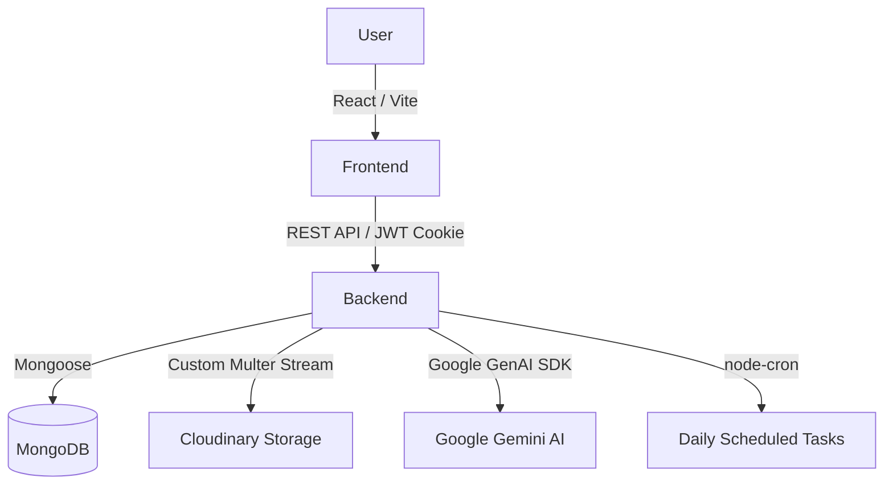

# The Legacy Trunk

> A digital family archive preserving stories, heirlooms, and memories across generations.

---

## 📌 Overview

**The Legacy Trunk** is a secure, private platform designed to help families build a digital archive. It solves the problem of fading family history by allowing members to record stories, build generational family trees, preserve media, and pass down digital heirlooms securely.

Whether you're mapping out your ancestry, sharing a memory from a recent holiday, or scheduling a "Time Capsule" for a future milestone, The Legacy Trunk ensures that your family's shared soul and magic live on.

---

## ✨ Features

### User Management & Authentication
* **Role-Based Access**: Roles (Creator, Admin, Member) within family groups.
* **Authentication**: Secure JWT-based authentication stored in HTTP-only cookies with bcrypt password hashing.
* **Claim Code Registration**: New users can register using a claim code that automatically links them to a pre-created Person node in the family tree and adds them to the family group.

### Memories & Stories
* **Rich Story Creation**: Record and share text stories, photos (up to 5 per memory), and videos.
* **AI-Powered Tagging & Search**: Automatically generates descriptive tags for uploaded photos using Google's Gemini AI, allowing users to effortlessly search their archives by context, objects, and activities.
* **Multi-Dimensional Search**: Search memories by title, description, tags, author name, tagged person name, or date — all from a single search bar.
* **Tagging**: Tag specific family members in memories.
* **Visibility Controls**: Keep memories private, share with selected members, or open them to the entire family circle.
* **Memory Versioning**: Edit history is preserved — each edit creates a snapshot in the `MemoryVersion` collection with auto-incrementing version numbers.
* **Collaborative Editing**: Authors, explicit collaborators, and tagged persons can edit memories (with restrictions — non-owners can only untag themselves).

### Secure Vault
* **Secondary Protection**: A dedicated, password-protected vault with an independent bcrypt-hashed password separate from the user's login password.
* **Cloud Storage**: File and heirloom storage backed by Cloudinary in user-specific folders.
* **Unlock-to-View**: File URLs are excluded from API responses until the vault is explicitly unlocked with the secondary password.

### Family Tree Management
* **Generational Mapping**: Build a complete family tree by specifying relationships (father, mother, son, daughter, spouse, brother, sister, etc.).
* **Smart Auto-generation**: The system automatically calculates generation levels via a Mongoose pre-save hook based on the relationship type to existing nodes.
* **Recursive Traversal**: Uses MongoDB's `$graphLookup` aggregation pipeline for efficient ancestor and descendant traversal in a single query.
* **Grafting Upwards**: Intelligently handles adding parents — if a child already has a parent, the new person is added as a spouse of the existing parent to maintain tree integrity.
* **Claim Codes**: Invite family members to claim their specific node in the family tree.

### Time Capsules
* **Scheduled Messages**: Create messages with a future delivery date and optional attachments.
* **Auto-Delivery**: Due capsules are automatically converted to Memory documents and notifications are sent to all family members when the feed is loaded.

### Notification System
* **Multi-Type Notifications**: Supports `memory_tag`, `memory_create`, `memory_share`, `new_member`, `tree_update`, `on_this_day`, and `birthday_alert` notification types.
* **TTL Auto-Cleanup**: Read notifications are automatically deleted by MongoDB after 7 days via a TTL index on the `readAt` field.
* **Daily Cron Alerts**: Background cron job (daily at 9 AM) sends "On This Day" memory anniversary alerts and birthday notifications to family members.

---

## 🏗️ System Architecture


```mermaid
flowchart TD
    User -->|"React / Vite"| Frontend
    Frontend -->|"REST API / JWT Cookie"| Backend
    Backend -->|Mongoose| MongoDB[(MongoDB)]
    Backend -->|"Custom Multer Stream"| Cloudinary["Cloudinary Storage"]
    Backend -->|"Google GenAI SDK"| Gemini["Google Gemini AI"]
    Backend -->|node-cron| Cron["Daily Scheduled Tasks"]
```

### Application Flow
1. **User Authentication**: User logs in and receives an HTTP-only/secure JWT stored as a cookie.
2. **Family Selection**: User selects or joins a family group (via Family Code + Password) or registers with a Claim Code.
3. **Data Retrieval**: Frontend fetches the family tree (via `$graphLookup` aggregation) and memory feeds from the Express API.
4. **Media Upload**: Media is streamed from Express to Cloudinary via a custom Multer storage engine (no server disk I/O), then image URLs are sent to Google Gemini for automatic AI tag generation.
5. **Scheduled Tasks**: A daily `node-cron` job runs at 9 AM to send birthday alerts and "On This Day" memory anniversary notifications. Time capsules are delivered on-demand when any user loads the memory feed.

---

## 📂 Project Structure

```text
The-Legacy-Trunk/
├── frontend/             # React (Vite) application
│   ├── src/
│   │   ├── assets/       # Static files and images
│   │   ├── components/   # Reusable UI components (Tree, Feed, Vault, Modals)
│   │   │   ├── profile/  # Profile-related sub-components
│   │   │   └── ui/       # Generic UI components (Toast, ConfirmModal, HistoryModal)
│   │   ├── contexts/     # React Context for auth state management
│   │   └── pages/        # Main application views (Home, Profile, Tree, Auth)
│   └── package.json
├── backend/              # Node.js / Express server
│   ├── config/           # Database, Cloudinary, and AWS configuration
│   ├── controllers/      # Route business logic (10 controllers)
│   ├── middlewares/      # Auth, access control, error handling, file upload
│   │   ├── auth/         # JWT verification (verifyAuth)
│   │   ├── access/       # Family membership & collaborator checks
│   │   ├── error/        # Global error handler
│   │   └── files/        # Custom Multer-Cloudinary streaming upload
│   ├── models/           # Mongoose schemas (User, Family, Person, Memory,
│   │                     #   MemoryVersion, SecureVault, StorageItem,
│   │                     #   ScheduledMessage, Notification)
│   ├── routes/           # Express API endpoints (10 route files)
│   ├── utiles/           # Gemini AI service, Cron jobs, Notification service
│   ├── server.js         # Entry point
│   └── package.json
└── README.md
```

---

## 🛠️ Tech Stack

| Technology | Purpose |
| ---------- | ------- |
| **React 19 + Vite** | Fast, modern frontend SPA framework |
| **Tailwind CSS** | Utility-first styling and responsive UI |
| **React Router v7** | Client-side routing with auth/family route guards |
| **Axios** | HTTP client with `withCredentials` for cookie-based auth |
| **Framer Motion** | Animations and transitions |
| **Node.js** | Backend JavaScript runtime |
| **Express 5** | Backend REST API framework |
| **MongoDB (Mongoose)** | NoSQL database with `$graphLookup` for tree traversal |
| **Cloudinary** | Cloud storage for media and Secure Vault files |
| **Multer** | File upload handling with custom Cloudinary streaming engine |
| **JWT & bcryptjs** | Authentication (HTTP-only cookies) and password hashing |
| **Helmet** | HTTP security headers |
| **express-rate-limit** | API rate limiting (100 req/min per IP) |
| **Node-Cron** | Background task scheduling for birthday and anniversary alerts |
| **Google Gemini AI** | Multimodal AI for automated image analysis and smart tagging |

---

### Key Data Model Concepts

* **User**: Represents the login account (username, email, password).
* **Person**: Represents a node on the Family Tree. A User can "claim" a Person via a claim code. Persons can exist without a linked User (e.g., deceased ancestors).
* **Family**: Represents the isolated group containing Persons and Memories, protected by a unique code and password.

---

## 🔌 API Documentation

Here are some of the core API endpoints that power the application:

| Method | Endpoint | Description | Auth Required |
| ------ | -------- | ----------- | ------------- |
| POST | `/api/v1/auth/register` | Register a new user account | No |
| POST | `/api/v1/auth/register-claim` | Register and claim a Person node | No |
| POST | `/api/v1/auth/login` | Authenticate user and return JWT cookie | No |
| GET | `/api/v1/auth/me` | Get current authenticated user | Yes |
| POST | `/api/v1/families` | Create a new family group | Yes |
| POST | `/api/v1/families/join` | Join a family with code + password | Yes |
| GET | `/api/v1/families/:familyId/members` | List family members | Yes |
| POST | `/api/v1/persons` | Add a person to the family tree | Yes |
| GET | `/api/v1/persons/tree/descendants` | Fetch descendant tree (`$graphLookup`) | Yes |
| GET | `/api/v1/persons/tree/ancestors` | Fetch ancestor chain (`$graphLookup`) | Yes |
| GET | `/api/v1/persons/tree/whole` | Fetch the entire family tree | Yes |
| POST | `/api/v1/persons/:personId/invite` | Generate a claim code for a person | Yes |
| POST | `/api/v1/memories/:familyId` | Publish a new memory/story (with files) | Yes |
| GET | `/api/v1/memories/:familyId` | Get memory feed (supports search) | Yes |
| POST | `/api/v1/vault/create` | Create a personal secure vault | Yes |
| POST | `/api/v1/vault/unlock` | Unlock vault with secondary password | Yes |
| POST | `/api/v1/vault/upload` | Upload a file to Secure Vault | Yes |
| POST | `/api/v1/scheduled-messages` | Create a Time Capsule | Yes |
| GET | `/api/v1/notifications` | Get user notifications | Yes |

---

## 🔐 Authentication & Security

* **Stateless Authentication**: Uses JWT (JSON Web Tokens) stored in HTTP-only cookies for authenticating API requests.
* **Password Hashing**: User passwords, Family passwords, and Secure Vault secondary passwords are salted and hashed using `bcryptjs` via Mongoose pre-save hooks.
* **Three-Layer Authorization Middleware**:
  * `verifyAuth` — Decodes JWT from cookie and loads User from MongoDB.
  * `isFamilyMember` — Verifies the user belongs to the target family.
  * `isCollaborator` — Checks if the user is the memory author, an explicit collaborator, or a tagged person.
* **Rate Limiting**: `express-rate-limit` prevents brute-force API attacks by limiting to 100 requests per minute per IP.
* **Security Headers**: `helmet` is implemented on the backend to set various HTTP security headers.
* **CORS**: Configured to safely accept cross-origin requests from the frontend client.
* **File Validation**: Multer file filter restricts uploads to images, videos, and PDFs with a 10MB size limit.

---

## 🖥️ Usage Flow

1. **Register & Login**: Create a new account (standard or via Claim Code to join an existing family tree).
2. **Create or Join**: Start a new family (generates a unique Family Code + Password) or join an existing one.
3. **Build the Tree**: Navigate to the Family Tree and start adding members. Define their relationships, and the system auto-calculates generations.
4. **Share a Memory**: Go to the feed, click "Create Story", upload photos/videos (streamed to Cloudinary), tag family members, set visibility, and publish. AI-generated tags are automatically added.
5. **Set a Time Capsule**: Schedule a message for a future date — it will automatically appear in the family feed when the date arrives.
6. **Lock Documents**: Navigate to the Secure Vault, set a secondary password, and upload sensitive family documents.

---

## 🧩 Challenges & Technical Decisions

* **Tree Traversal with `$graphLookup`**: Uses MongoDB's `$graphLookup` aggregation pipeline to recursively traverse ancestors and descendants in a single query, avoiding multiple application-level round trips. Each `Person` stores a `relationTo` reference and `relationType`; the aggregation follows these links recursively.
* **Tree Generation Logic**: Instead of manually setting hierarchies, the `Person` model dynamically calculates its `generation` level via a pre-save hook based on its relationship (father, mother, son, daughter) to existing nodes. This greatly simplifies frontend rendering.
* **Grafting Upwards**: When adding a parent to someone who already has a parent, the system intelligently adds the new person as a spouse of the existing parent to maintain tree integrity.
* **Custom Multer-Cloudinary Storage**: Built a custom Multer storage engine (`CloudinaryCustomStorage`) that streams file uploads directly to Cloudinary via `upload_stream` — zero server disk I/O. Two instances handle public uploads (memories) and private uploads (vault, per-user folders).
* **AI-Powered Tagging**: Integrated Google's Gemini API (`@google/genai`) to automatically analyze multi-image memory uploads. Images are fetched from Cloudinary URLs, base64-encoded, and sent to Gemini with a structured JSON output schema. The AI generates 5-10 descriptive tags, powering a robust search experience without manual data entry. If the AI call fails, the upload succeeds gracefully without tags.
* **Secure Vault Isolation**: To ensure maximum privacy, the `SecureVault` model requires a *secondary* bcrypt-hashed password that is completely independent of the user's login password. File URLs are excluded from GET responses until the vault is unlocked.
* **Time Capsule Delivery**: Due capsules are automatically converted to Memory documents and notifications are broadcast to all family members when the feed is loaded, ensuring delivery when users are active.
* **Notification TTL**: Uses MongoDB's TTL index on `readAt` to automatically delete read notifications after 7 days — unread notifications persist indefinitely.
* **Memory Versioning**: Each edit to a memory creates a version snapshot in the `MemoryVersion` collection, with auto-incrementing version numbers calculated server-side.
* **User ↔ Person Separation**: A `User` is a login account; a `Person` is a tree node. Persons can exist without Users (deceased ancestors, children). Users "claim" Persons via invite codes, enabling family tree creation before all members have registered.

---
